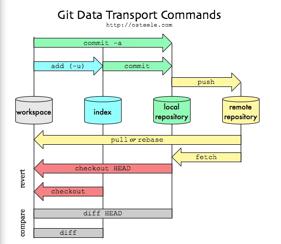

# Git and GitHub Workshop

## Ramiro Magno | 28 September 2020
---
#### Notes from Isabel Duarte | 28 September 2020

### A. Introduction
*NOTE: Please take notes (on paper -> then type them to file; or directly into a text file).*

#### 1. What is Git?
+ It is a distributed **version control system**.
+ It is a program, invented by Linus Torvalds (the "father" of Linux).
+ It allows keeping track of the changes in a project (i.e. a whole folder with several folders and/or files simultaneously -> it tacks changes in a collection of files simultaneously).
+ It allows the revision and restoring of files from previous versions.

#### 2. What is GitHub
+ It is a Git repository.
+ It is a distributed code-hosting platform for version control and collaboration.
+ Open source oriented.

#### 3. Files and Filesystems
+ **Drives** (permanent storage) -> physical system = Hardware
+ **Volume** is a partition of a drive that can contain a filesystem.
+ There are mainly two categories of file formats: **Binary** and **Text files**.
+ The Encoding of text files is a table that maps binary code to characters/symbols (letters, digits, punctuation, etc). E.g. ASCII, UTF8, UTF16, etc.  
+ In text files, 1 byte = 8 bits = 1 character.
+ This allows 2^8 different combinations (256 possible character combinations).  

#### 4. Preparation steps
+ Install Typora (or other markdown editor).
+ Install Git:
  ++ Windows
  ++ macOS (via XCode) -> already installed in mine (git version 2.24.3 Apple Git-128)
  ++ Linux (nothing to be done - it comes pre-installed) -> (git version 2.25.1)

### B. Git Mechanics


+ Workspace is the folder of our project -> create one and put a markdown file in it.
+ After installing Git:

#### 1. Setting up the system (once per computer/project)
```
git config --global user.name "I Duarte"
git config --global user.email "iduarte.scientist@gmail.com"

# Check that the global settings are correct
git config --global --list

# Note: We can have different settings for individual project:
git config --list

```

#### 2. Create a Git repository

```
# 1. Navigate to the folder of my project
cd /path/to/my/project/folder

# 2. Create a Git repository (it creates a ".git" hidden folder that will allow the tracking of changes)
git init

# 3. Check the status of the newly created repository
git status

# 4. Add the markdown file to the list of files to be tracked for changes (Select the file or files that we will be included in the following commit command)
git add file-name

# 4.1. Check again the status of the repository (make sure that the previous command worked)
git status

# 5. Commit the changes to the file selected by "git add" to the repository
git commit

# 5.1. This command opens the default Git text editor (in my Linux system is Vim)
 - Add the title of the message explaining the changes (<80 chars)
 - Add 2 new lines (press enter twice)
 - Add a longer description of the the commit/changes

  # To change the default Git text editor, run:
  git config --global core.editor neweditorname

```

#### 3. Interaction with your new Git Repository

```
# Show all the commits done so far
git log

# Check if there are changes in the local file
git status

# See the differences between the local version and the last commit
git diff

# A gitignore file specifies intentionally untracked files that Git should ignore
  # Create a file named: ".gitignore"

```

#### 4. Shortcut commands

```
# Add the title of the text description associated with the change immediately with the commit command
git commit -m "Some text describing the change"

# Add and commit more than one file simultaneously
git add file1 file2 file3 *.pdf
git commit -m "Added all pdf files and some changes in 3 other files."

# Graphical User Interface (GUI) for Git
gitk

```

### C. GitHub Repositories

+ The greatest advantage of using a remote Git repository, such as GitHub, is that it greatly facilitates the collaboration on the same project.

#### Steps to put the local Git repository on GitHub
```
# 1.Create a new repository on GitHub (online). It is advisable to give it the same name as the local one.
  # Very importantly, do NOT create any additional file online, such as a README or a Licence file (because this will make the local and remote repositories incompatible).

# 2. Add the local repository to GitHub:
git remote add origin https://github.com/username/repositoryname

# 3. Check the status of the remote add
git remote -v

# 4. Push the local repository to the remote GitHub repository, along with necessary commits and
objects (It synchronizes the local with the remote repository).
git push origin master

# 5. Clone a remote repository
git clone github.com/repositoryname

```

_END_
